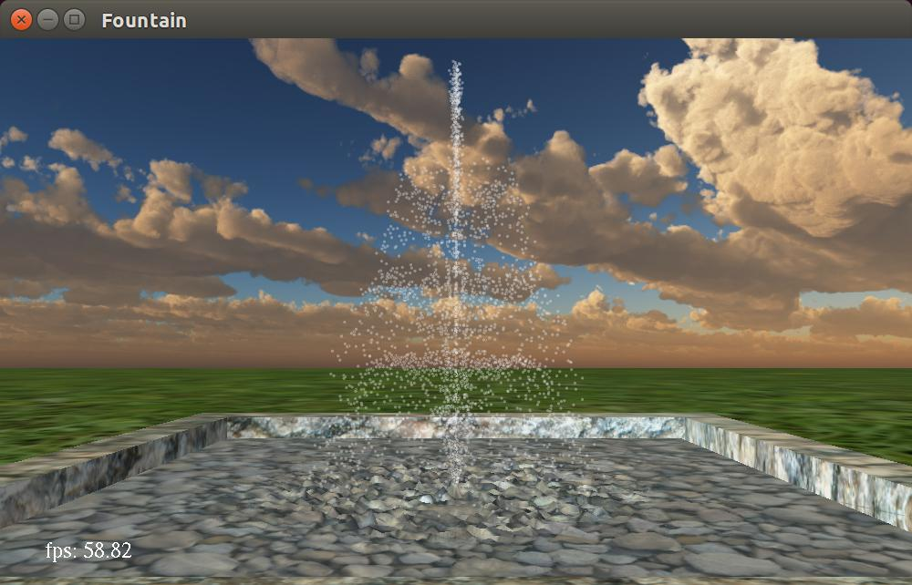

# Fountain

* Zhang Qiuyi, 12330402
* Kuang Jiahao, 12330152
* Li Jianhua, 12330165

## Dependencies

* freeglut (local library, included in the project)
* FreeImage (local library, included in the project)
* OpenGL and GLU

## What is it?

A fountain built with OpenGL fixed piepline.

Note: this can look quite different on different machines:

* The computational power(or, the optimization performed by the compiler) will affect the frame rate, therefore affect the speed of the fountain water. If your computer is powerful enough, the frame rate will be around 58fps.
* The resolution of the screen will affect the overall experience, including font size, texture, and the size of water particles.

Under normal resolution, it looks like this:


Under HiDPI, it looks like this:


## Techniques Used

1. First person camera(see "Operation" below for information about the keyboard controls)
2. Texture(basin, ground, skybox)
3. Lighting(two-side)
4. Skybox
5. Simulated water(particles)
6. Simulated waves(oscillators)
7. Display list(skybox, ground, fountain basin)
8. Fonts and text(there is a frame rate counter at the bottom left)

### Explanation about the water and the waves

* The water is just semi-transparent particles(points) moving along calculated parabolas.
* The waves are simulated by oscillators. They change the vertices of the pool and update the normals accordingly to create ripples. The position of these oscillatiors are affected by their neighbors, and the oscillators on the edge will always have a constant `y`. Therefore the waves will bounce back when they reach the edge.

Look closer and take a screenshot, then you will know what is going on. For more information, checkout `Fountain.cpp` and `Pool.cpp` and read the comments.


### Shapes




To lower down the burden on the CPU, the preset shapes are rather simple(with not many rays per level or drops per ray). If you want to see some fancier shapes, you can go tweak the initializers in `main.cpp`.

## Operations

* <kbd>1</kbd> - <kbd>8</kbd>: Change the shape of the fountain
* <kbd>f</kbd>: Toggle fullscreen mode
* <kbd>c</kbd>: Toggle mouse mode
* <kbd>ESC</kbd>: exit

### Under Keyboard Mode
* <kbd>→</kbd>, <kbd>←</kbd>: Turn camera right / left
* <kbd>↑</kbd>, <kbd>↓</kbd>: Move camera forward / backword
* <kbd>r</kbd>, <kbd>v</kbd>: Turn camera up / down
* <kbd>w</kbd>, <kbd>s</kbd>: Move camera up / down
* <kbd>a</kbd>, <kbd>d</kbd>: Move camera left / right

### Under Mouse mode
* Mouse move: Rotate camera
* Mouse scroll: tMove forward / backward

## File structure

```
  - doc  // report goes here
  - include  // header files
  - lib  // static libraries
  - resource  // e.g. textures
  - src  // source code
  - screenshot // screenshots

  // dynamic library for the prebuilt executable
  - freeglut.dll
  - FreeImage.dll
  - libstdc++-6.dll
  - libgcc_s_dw2-1.dll

  - Fountain.sln   // VS2013 project file
  - Fountain.exe  // prebuilt executable
  - premake5.lua  // premake5 script

  // preview of this demo
  - normal-preview.jpg
  - hidpi-preview.jpg

  - README.md   // you are reading it :)
```

## About the executable

The executable is built for Windows with MinGW, the necessary libraries are all bundled inside this project. Just run `Fountain.exe` to see it at work.

If you want to run it under Linux, you need to build it from source.

## How to build it?

You can build it with VS2013 and above, Make and MinGW(or just Make and `g++` under Linux), or anything that premake5 supports and has some `C++11` support(VS2010 or above should do the trick).

This has been tested under:

1. Windows 8.1 + VS2013
2. Windows 8.1 + MinGW(`g++` (GCC) 4.8.1) + GNU Make 3.81(Win32 port)
4. Ubuntu 14.04 + `g++` 4.8.2 + GNU Make 3.81

If you are using Windows, you don't need to copy any file to any location. All libraries files(.h, .lib and .dll) are locally included. Note that it is the libraries under `include` and `lib` that will actually get linked, not your global libraries.

### Windows with VS2013

Open the `Fountain.sln` with VS and build the `Fountain` target. The executable will appear under the project directory, named `Fountain.exe`.

### Windows with Make+MinGW / older VS

Download premake5 from [here](https://premake.github.io/download.html#v5), extract the executable in the archive(e.g. `premake5.exe`), and put the path to the executable in your `PATH` environment variables. Then open cmd and run `premake5 --help` to see what project files you can generate. I've written the premake script `premake5.lua` to generate the proper project files.

For example, to generate the project files for VS2012, simply run `premake5 vs2012` under the project directory, then open `Fountain.sln` with your VS and build the `Fountain` target. The executable will appear under the project directory, named `Fountain.exe`.

### Linux with Make and `g++`

You need to install freeglut and FreeImage first. For example, if you are using Ubuntu, run

```bash
$ sudo apt-get install build-essential freeglut3 freeglut3-dev binutils-gold
$ sudo apt-get install libfreeimage3 libfreeimage-dev
```

Download premake5 from [here](https://premake.github.io/download.html#v5), extract the executable in the archive(e.g. `premake5`), and put the path to the executable in your `PATH` environment variables(e.g. extract the file to `/usr/local/bin` with root permission so you don't have to touch `PATH`). To generate the project files for make, simply run `premake5 gmake`, then run `make` to build it. The executable will appear under the project directory, named `Fountain`.
